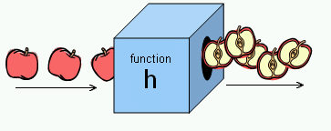

Scripts:
+ series of instructions
+ specificity is key
+ step by step IN ORDER

To write a script:
1. state goal--Define Goal
2. list tasks TBD IN ORDER--Design the script
+ flowchart?? remember robot exercise
3. Code each step

Each time the script runs it might only use a subset of the code (until T is validated)

An **expression** evaluates into a single value using **assignment** or some sort of **computation** of 2 or more values using **operators**

Operators
+ assignment op
+ arithmetic op (+ - / * ++ -- %)
+ string op
+ comparison op
+ logical op

+ (++) increments number by one
+ (--) decrements by number by one
+ % modulus divides 2 values and returns remainder

+ string concatonates using +

Functions see 90-95
+ group a sweries of statements together ot perform a specific task
+ some need pieces of info called **parameters**
+ when you write a fn that gives a response that's a **return value**
+ return statement is not always needed
+ declaration using keyword: function.name() {stuff to do}
+ called with name(); if needs info that goes in the ()
+ **always start with lower case**
+ test in console log??

